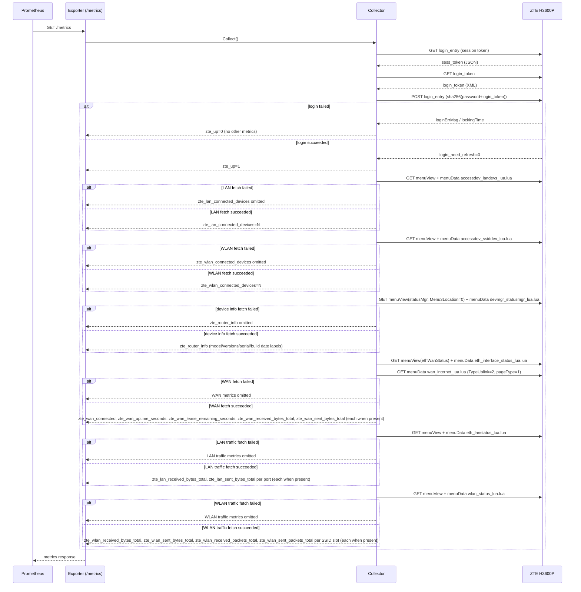

# Flows

This exporter has a single HTTP endpoint, `/metrics`, scraped by
Prometheus.

## `/metrics` scrape flow

## Notes

- A fresh login is performed on every scrape in this version; no session
  is cached between scrapes.
- A login failure results in `zte_up=0` and the scrape omits every other
  metric, rather than reporting zeroed or fabricated values.
- Once login succeeds, `zte_up=1` regardless of what happens next. The
  LAN, WLAN, device info, WAN, LAN traffic, and WLAN traffic fetches then
  run independently — the six are guarded separately, so a single fetch
  failure (e.g. an unparseable WAN response) only omits that fetch's own
  metrics for the cycle, leaving the rest of the scrape intact.
- Login and all six fetches run sequentially against the exporter's
  single `ScrapeTimeout`, with no per-fetch sub-budget; a slow fetch can
  crowd out later ones within the same cycle.
- Each of the six fetches — LAN devices, WLAN devices, device info, WAN
  status, LAN traffic, and WLAN traffic — re-primes its own `menuView`
  context independently rather than chaining off another fetch's
  priming. LAN traffic (`eth_lanstatus_lua.lua`) and WLAN traffic
  (`wlan_status_lua.lua`) both prime the same `localNetStatus` menuView
  tag the existing LAN/WLAN device fetches already use, the same way
  those two fetches do today, rather than following the WAN fetch's
  two-script sequential-priming shape: this keeps a LAN traffic fetch
  failure from being able to cascade into a WLAN traffic failure, and
  vice versa.
- The WAN fetch primes with `menuView` once, then issues two `menuData`
  calls in sequence rather than re-priming between them, confirmed
  against a live H3600P: `eth_interface_status_lua.lua` establishes the
  WAN sub-page's server-side context that `wan_internet_lua.lua` (the
  actual connection status/uptime/lease data) requires. The second call
  also requires the `TypeUplink=2`/`pageType=1` query parameters,
  confirmed against a live H3600P's real request — without them the
  router rejects the request as if the session were invalid.
  `eth_interface_status_lua.lua`'s response also supplies the
  interface's byte counters
  (`zte_wan_received_bytes_total`/`zte_wan_sent_bytes_total`).
- The device info fetch's `menuView` call requires a `Menu3Location=0`
  query parameter alongside the `statusMgr` tag, confirmed against a
  live H3600P; `devmgr_statusmgr_lua.lua`'s response is the router's
  device-info page (model, firmware/hardware/boot versions, serial
  number, firmware build date), not the CPU/memory/uptime data
  originally assumed for this endpoint — no working source for those
  fields has been found on this router/firmware, so they are not
  exposed by this exporter.
