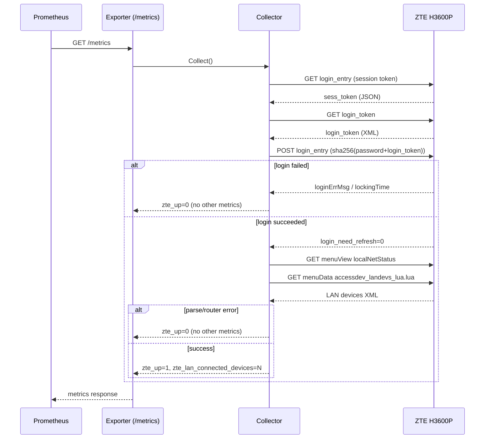

# Flows

This exporter has a single HTTP endpoint, `/metrics`, scraped by
Prometheus.

## `/metrics` scrape flow

## Notes

- A fresh login is performed on every scrape in this version; no session
  is cached between scrapes.
- Any failure (network, auth, parsing) results in `zte_up=0` and the
  scrape intentionally omits device/health metrics rather than reporting
  zeroed or fabricated values.
