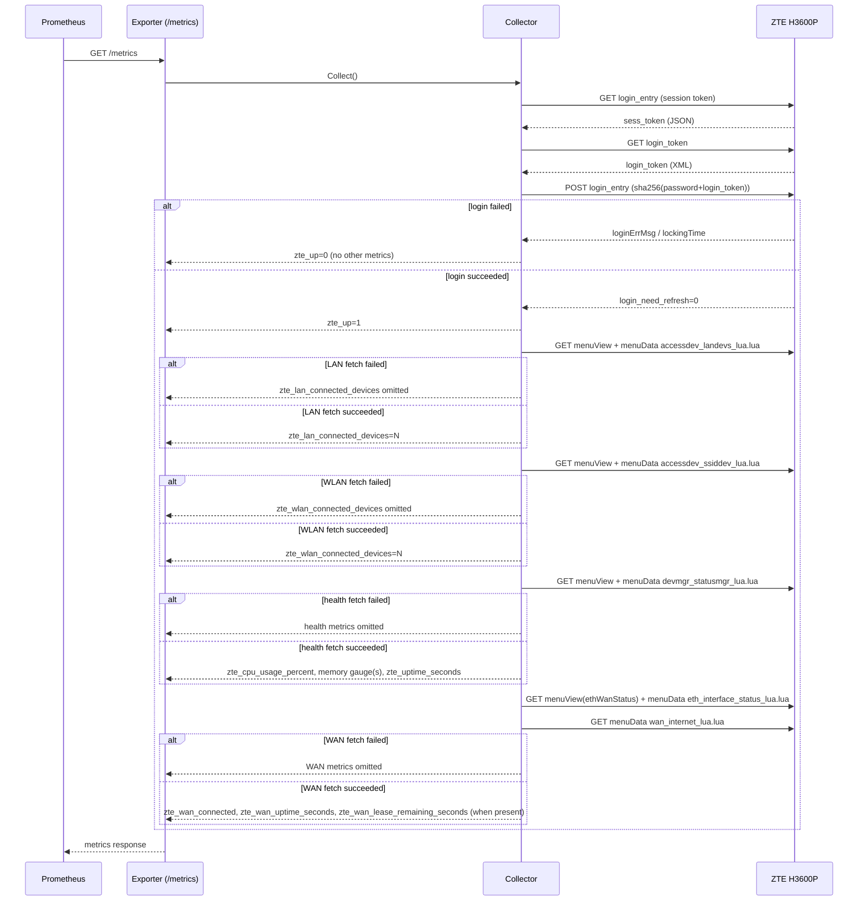

# Flows

This exporter has a single HTTP endpoint, `/metrics`, scraped by
Prometheus.

## `/metrics` scrape flow

## Notes

- A fresh login is performed on every scrape in this version; no session
  is cached between scrapes.
- A login failure results in `zte_up=0` and the scrape omits every other
  metric, rather than reporting zeroed or fabricated values.
- Once login succeeds, `zte_up=1` regardless of what happens next. The
  LAN, WLAN, health, and WAN fetches then run independently — the four
  are guarded separately, so a single fetch failure (e.g. an unparseable
  WAN response) only omits that fetch's own metrics for the cycle,
  leaving the rest of the scrape intact.
- Login and all four fetches run sequentially against the exporter's
  single `ScrapeTimeout`, with no per-fetch sub-budget; a slow fetch can
  crowd out later ones within the same cycle.
- The WAN fetch primes with `menuView` once, then issues two `menuData`
  calls in sequence rather than re-priming between them, confirmed
  against a live H3600P: `eth_interface_status_lua.lua`'s response isn't
  used for any metric, but fetching it is what establishes the WAN
  sub-page's server-side context — `wan_internet_lua.lua` (the actual
  data source) only succeeds when fetched immediately after it.
