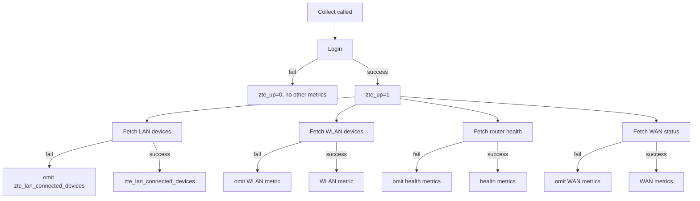

# Remaining Collectors (WLAN, Router Health, WAN Status) - Plan

## Goal Capsule

- **Objective:** extend the ZTE-Exporter collector with WLAN device, router health, and WAN status metrics, each degrading independently on failure, with unit tests and doc updates.
- **Product authority:** Notion task "2. Remaining collectors (WLAN, router health, WAN status)" (P2, due 2026-06-30) under project "Plataforma monitorización".
- **Open blockers:** none launch-blocking. Exact field names/value formats returned by `devmgr_statusmgr_lua.lua` remain unverified against the live router — deferred to implementation (see Outstanding Questions, Planning Contract Assumptions). `accessdev_ssiddev_lua.lua`'s id-element shape (Q3) is now confirmed; the WAN status script/shape/field names (Q2) are now mostly confirmed, with the DHCP lease field name still open.

---

## Product Contract

### Summary

Add three Prometheus collectors — WLAN connected-device count, router health (CPU, memory, uptime), and WAN status (connected boolean, connection uptime, DHCP lease remaining) — to the existing ZTE H3600P scrape. Each collector now degrades independently instead of the current all-or-nothing failure model.

### Problem Frame

The exporter currently reports only the LAN-connected-device count and overall reachability (`zte_up`); WLAN devices, router health, and WAN status are unimplemented, even though `docs/uml.md` already anticipates WLAN via the `Device.NetworkType` field. Today, any single fetch failure zeroes every metric for that scrape (`zte_up=0`) — a model that gets more costly as more independent data sources join a single scrape, since one flaky WAN status fetch shouldn't blank the LAN device count too.

### Key Decisions

- **Per-collector degradation (KD1):** replaces all-or-nothing. `zte_up` reflects login/reachability only. Each of the four data fetches (LAN, WLAN, health, WAN) is now independently guarded; a fetch failure omits only that fetch's metrics for the scrape. This changes the existing `zte_lan_connected_devices` metric's failure behavior too, not just adds new metrics.
- **No dedicated failure-visibility metrics (KD2):** no per-collector up gauges (e.g. `zte_wlan_up`) and no dedicated WAN error metric. A metric missing on a scrape where `zte_up=1` is the failure signal, matching the project's existing "omit rather than fabricate" philosophy.
- **WAN connection collapses to one boolean (KD3):** `zte_wan_connected` (1/0), with "Connecting" treated as disconnected (0). No raw status-text or error-label metric.
- **Memory usage prefers raw bytes (KD4):** expose memory as used/total byte gauges if `devmgr_statusmgr_lua.lua` provides them; fall back to a single percentage gauge if it only provides a percentage. Verify against the live router response before implementation.
- **Two distinct uptime metrics (KD5):** router system uptime (health collector) and WAN connection uptime (WAN status collector) are different values sharing the word "uptime" in the source task — they must not share a metric name.

### Requirements

**WLAN device collector**
- R1. The exporter fetches WLAN-connected devices from the router via `accessdev_ssiddev_lua.lua`, mirroring the existing LAN fetch pattern (`internal/zteclient/devices.go`), tagging results with `Device.NetworkType="WLAN"`.
- R2. The exporter exposes a WLAN-connected-device count gauge, following the same naming convention as the existing `zte_lan_connected_devices` metric.
- R3. A WLAN fetch failure omits only the WLAN device count metric for that scrape; it does not affect `zte_up` or any other collector's metrics.

**Router health collector**
- R4. The exporter fetches router health data via `devmgr_statusmgr_lua.lua`: CPU usage, memory usage, and router uptime.
- R5. CPU usage is exposed as a percentage gauge.
- R6. Memory usage is exposed as raw used/total byte gauges if the router response provides them; otherwise as a single percentage gauge (KD4).
- R7. Router uptime is exposed as a seconds gauge, distinct from WAN uptime (KD5).
- R8. A router health fetch failure omits only the health metrics for that scrape; it does not affect `zte_up` or any other collector's metrics.

**WAN status collector**
- R9. The exporter fetches WAN status via `wan_internet_lua.lua`, reading connection status, connection uptime, and DHCP lease remaining time from the response when present (the raw error field is read but not surfaced as a metric, per KD3).
- R10. WAN connection status is exposed as a single boolean gauge (`zte_wan_connected`), where any router status other than a fully-connected state (including "Connecting") reports 0.
- R11. WAN DHCP lease remaining time is exposed as a seconds gauge when the connection type provides one; PPPoE connections have no lease concept and simply omit this gauge.
- R12. WAN connection uptime is exposed as a seconds gauge, distinct from router uptime (KD5).
- R13. A WAN status fetch failure omits only the WAN metrics for that scrape; it does not affect `zte_up` or any other collector's metrics.

**Cross-cutting**
- R14. `zte_up` reports 1 whenever login succeeds, regardless of whether any individual collector's fetch subsequently fails (KD1).
- R15. Each new collector has unit test coverage following the existing pattern in `internal/collector/collector_test.go` and `internal/zteclient/*_test.go` (success, fetch-failure, and parse-error cases per collector).
- R16. `README.md`'s metrics table is updated with every new metric.
- R17. `docs/uml.md` and `docs/flows.md` are updated in the same change to reflect the new collectors and the per-collector degradation flow.
- R18. A LAN fetch failure omits only the `zte_lan_connected_devices` metric for that scrape; it does not affect `zte_up` or any other collector's metrics (KD1).

### Key Flows

- F1. Scrape with per-collector degradation
  - **Trigger:** Prometheus `GET /metrics`.
  - **Actors:** Exporter, ZTE H3600P router.
  - **Steps:** Exporter logs in; on failure, `zte_up=0` and no other metrics are reported. On success, `zte_up=1`, then the LAN, WLAN, health, and WAN fetches each run and are guarded independently — a failure in any one omits only that fetch's metrics from the response.
  - **Outcome:** the scrape response always reflects login success/failure via `zte_up`, plus whichever of the four metric groups succeeded this cycle.
  - **Covers:** R1, R3, R4, R8, R9, R13, R14



### Scope Boundaries

- Per-collector enable/disable config toggles — not requested; all four collectors always run every scrape.
- Dedicated WAN error metric and raw WAN status-text/error-label metric — dropped in favor of the single `zte_wan_connected` boolean (KD3).
- Dedicated per-collector up/failure gauges (e.g. `zte_wlan_up`) — dropped; metric absence is the failure signal (KD2).

### Dependencies / Assumptions

- Exact field names and value formats returned by `devmgr_statusmgr_lua.lua` are unverified against the live router.
- The WAN status response's full set of `ConnStatus` values and the DHCP lease field name remain unconfirmed (see Q2); the exporter's tested router is PPPoE, which has no lease field at all.
- Whether the router's memory data is available as raw bytes or only as a percentage is unknown until the live response is inspected (affects R6).

### Outstanding Questions

**Resolve before planning:**
- None — all product-shape decisions were resolved in dialogue.

**Deferred to planning / implementation:**
- Q1. What are the exact field names and value formats in the `devmgr_statusmgr_lua.lua` response (CPU, memory, uptime)? Resolve by inspecting a live router response (KD4, R6, R7).
- Q2 (partially resolved). The WAN status page primes with menuView tag `ethWanStatus`, then fetches `eth_interface_status_lua.lua`'s menuData (discarded, but required to establish the page's server-side context) followed by `wan_internet_lua.lua`'s menuData (not `wanStatus`/`wan_internetstatus_lua.lua` alone, and not a fresh menuView per call) — the latter also requires `TypeUplink=2&pageType=1` query parameters, without which the router returns an HTML page instead of the expected XML. The response is nested one `Instance` under `ID_WAN_COMFIG` (not flat at the response root), with fields `ConnStatus` and `UpTime` (not `ConnectionStatus`/`WANUptime`) — all confirmed against a live H3600P on a PPPoE connection. Still open: the full set of possible `ConnStatus` values (only "Connected" observed so far), whether `TypeUplink`/`pageType` need different values on a router with multiple WAN profiles, and the field name for DHCP lease remaining time — no lease field appears anywhere in a PPPoE connection's response, since PPPoE has no lease concept; the field name (if any) remains unconfirmed for a DHCP-based WAN connection (R10, R11).
- Q3 (resolved). `accessdev_ssiddev_lua.lua`'s response shape was confirmed against a live H3600P: it returns devices under `OBJ_ACCESSDEV_ID`, the same element LAN uses, not a WLAN-specific element name.

### Sources / Research

- `internal/zteclient/devices.go:21-24` — existing LAN fetch uses `accessdev_landevs_lua.lua` and the `OBJ_ACCESSDEV_ID` id element; `internal/zteclient/devices.go:18` already reserves `NetworkType="WLAN"` for future use.
- `internal/collector/collector.go:49-71` — current all-or-nothing `Collect()` implementation to be extended into per-collector degradation.
- `docs/uml.md:68-69` — prior note: "`Device` is shared between LAN and (future) WLAN collection."
- `docs/flows.md` — current scrape sequence diagram, to be updated for the new fetches and degraded-failure branches.
- `README.md` metrics table — to be extended with the new metrics.
- Notion task `38303d3fc17a813ba54cd584bbe168b4` ("2. Remaining collectors (WLAN, router health, WAN status)") — source of the lua script names and metric categories.

**Product Contract preservation:** unchanged from the brainstorm.

---

## Planning Contract

### Key Technical Decisions

- **KTD1 — shared sequential timeout budget.** Login and all four fetches (LAN, WLAN, health, WAN) run sequentially against the existing single `ScrapeTimeout`, with no per-fetch sub-budget. This keeps the timeout model identical to today's; a slow fetch can crowd out later ones in the same cycle, same failure shape as today's single-fetch scrape just spread across more calls. Confirmed with the user during scoping rather than introducing a new per-fetch timeout config surface.
- **KTD2 — shared single-record parsing helpers.** `internal/zteclient/health.go` and `internal/zteclient/wanstatus.go` parse their router responses with helpers built on the existing `instance` type (`internal/zteclient/devices.go`). WAN status is confirmed (against a live H3600P) to nest one `Instance` under a page-specific element (`ID_WAN_COMFIG`) — the same shape `parseDevices`/`findSections` already handle for device lists — so it uses a new `parseSingleInstance` helper built on `findSections` rather than a flat-parameter parse. Router health's shape is still unconfirmed and continues to use the originally-planned flat-parameter helper (`parseFlatParams`) pending live verification. No new XML-decoding abstraction beyond these two helpers is introduced.
- **KTD3 — WLAN reuses the LAN fetch machinery.** `GetWLANDevices` calls the existing `parseDevices`/`findSections`/`devicesFromInstances` functions unchanged, parameterized by a new WLAN script name and id element constant — the same way `GetLANDevices` already parameterizes them. No WLAN-specific parsing code.
- **KTD4 — `Collect` becomes four independently-guarded steps.** Replaces the single `scrape()` method with login (unchanged early-return-on-failure for `zte_up`) followed by four sequential fetch-and-set steps, each logging a warning and skipping only its own gauge(s) on error. No interface/plugin abstraction — matches the codebase's existing preference for concrete code over generic collector registries at this scale (four fetches, not an open-ended set).
- **KTD5 — metric names.** Follow the existing `zte_<domain>_<measure>` convention (`zte_lan_connected_devices`, `zte_up`): `zte_wlan_connected_devices`, `zte_cpu_usage_percent`, `zte_memory_used_bytes` / `zte_memory_total_bytes` (primary) or `zte_memory_usage_percent` (fallback per KD4), `zte_uptime_seconds`, `zte_wan_connected`, `zte_wan_uptime_seconds`, `zte_wan_lease_remaining_seconds`.

### Assumptions

- The router's health and WAN status responses are a flat `ajax_response_xml_root` with direct `ParaName`/`ParaValue` children (the same shape as one `Instance` block), not nested `Instance` sections — to confirm while building U2/U3.
- WLAN devices' id element is `OBJ_ACCESSDEV_ID`, the same element LAN uses — confirmed against a live router (Q3); there is no separate WLAN-specific id element.
- The router exposes memory as raw used/total bytes; if it only exposes a percentage, U2 falls back to the single percentage gauge per Product Contract KD4.

### Sequencing

U1 adds the shared flat-parameter helper (KTD2) alongside its own WLAN fetch, so U2 and U3 both depend on U1 for that helper — they are not independent of it, though U2 and U3 are independent of each other. U4 depends on U1, U2, and U3 (it wires their gauges into `Collect`). U5 depends on U1-U4 being final so the diagrams and tables describe the shipped shape.

### Risks & Dependencies

- The three field-name/shape assumptions above are the main execution risk: if the router's actual response diverges (e.g., health data nested under an `Instance` rather than flat), U2/U3's parsing approach needs adjusting during implementation — the shared-helper design in KTD2 keeps that adjustment localized to one helper rather than two duplicated parsers.
- Depends on physical access to a live ZTE H3600P router to verify response shapes and to run any manual end-to-end check beyond the fake-router unit tests.

---

## Implementation Units

### U1. WLAN device fetch

- **Goal:** Add `GetWLANDevices` to the zteclient package, fetching WLAN-connected devices via `accessdev_ssiddev_lua.lua` and tagging them `NetworkType="WLAN"`, mirroring the existing `GetLANDevices`. Also add the shared single-record parsing helpers (KTD2) that U2 and U3 depend on.
- **Requirements:** R1, R2, R3
- **Dependencies:** none
- **Files:**
  - `internal/zteclient/devices.go` (modify — add `wlanScript` const, `GetWLANDevices` (reusing `lanIDElement`, confirmed shared with WLAN per Q3), plus `parseFlatParams` and `parseSingleInstance`, both built on the existing `instance` type)
  - `internal/zteclient/devices_test.go` (modify — add WLAN test coverage)
- **Approach:** Reuse `parseDevices`, `findSections`, and `devicesFromInstances` unchanged, parameterized the same way `GetLANDevices` already parameterizes them by script name, id element, and network-type string. This is a second caller of the existing generic path, not new parsing code. Also add the shared single-record parsing helpers (KTD2) here, since both build on the `instance`/`findSections` machinery already defined in this file — U2 depends on `parseFlatParams`, U3 depends on `parseSingleInstance` (confirmed as the correct shape for WAN status against a live router).
- **Patterns to follow:** `internal/zteclient/devices.go:52-71` (`GetLANDevices`) — menu-context GET, then menuData GET, then `parseDevices`.
- **Test scenarios:**
  - Happy path: fake router returns two WLAN device instances with MAC/IP/HostName/Active fields → `GetWLANDevices` returns two `Device{NetworkType: "WLAN"}` entries. Covers R1.
  - Edge case: fake router returns an instance with no MAC address → skipped, same as the existing LAN no-MAC coverage. Covers R1.
  - Error path: the menu-context GET fails (HTTP 500) → `GetWLANDevices` returns an error. Covers R3.
  - Error path: the menuData GET returns invalid XML → `GetWLANDevices` returns a parse error. Covers R3.
- **Verification:** `go test ./internal/zteclient/...` passes; new WLAN tests fail before the change and pass after.

### U2. Router health fetch

- **Goal:** Add a `GetHealth` method to the zteclient package, fetching CPU usage, memory usage, and router uptime via `devmgr_statusmgr_lua.lua`.
- **Requirements:** R4, R5, R6, R7, R8
- **Dependencies:** U1 (shared flat-parameter helper)
- **Files:**
  - `internal/zteclient/health.go` (new)
  - `internal/zteclient/health_test.go` (new)
- **Approach:** Define a `Health` struct (CPU percent; optional used/total memory bytes; optional memory percent; uptime seconds). Prime the menu context with a `menuView` GET before the `menuData` fetch, mirroring `GetLANDevices`'s two-step pattern — determine the correct page-specific `_tag` against a live router alongside Q1. Parse the response with the shared flat-parameter helper (KTD2, added in U1). Populate memory as raw bytes when the response provides them; fall back to the percentage field otherwise (Product Contract KD4).
- **Technical design:** *(directional, not implementation-specification)*
  ```
  GetHealth(ctx):
    menuView(ctx, healthTag)   // priming call, mirrors GetLANDevices
    body := get(menuData, devmgr_statusmgr_lua.lua)
    params := parseFlatParams(body)   // shared helper, KTD2
    return Health{
      CPUUsagePercent: from params,
      MemoryUsedBytes/MemoryTotalBytes (or MemoryUsagePercent fallback): from params,
      UptimeSeconds: from params,
    }, err
  ```
- **Patterns to follow:** `internal/zteclient/devices.go:52-57` (`GetLANDevices`'s `menuView` priming GET before `menuData`); `internal/zteclient/devices.go:31-44` (`instance.params()`) for the flat-parameter shape; `internal/zteclient/client.go:64-69` (`ajaxResponse.checkError`) for router-error handling.
- **Test scenarios:**
  - Happy path: fake router returns CPU / memory-bytes / uptime fields → `GetHealth` returns a populated `Health` with correct values. Covers R4, R5, R6, R7.
  - Fallback path: fake router response omits raw memory bytes but includes a memory-percent field → `GetHealth` populates the percentage form instead. Covers R6.
  - Error path: the menuData GET fails → `GetHealth` returns an error. Covers R8.
  - Error path: the router returns a non-SUCC `IF_ERRORSTR` → `GetHealth` returns an error. Covers R8.
  - Error path: the response is unparseable XML → `GetHealth` returns a parse error. Covers R8.
- **Verification:** `go test ./internal/zteclient/...` passes; both memory-representation branches are exercised.

### U3. WAN status fetch

- **Goal:** Add a `GetWANStatus` method to the zteclient package, fetching WAN connection status, connection uptime, and DHCP lease remaining time (when present) via `wan_internet_lua.lua`.
- **Requirements:** R9, R10, R11, R12, R13
- **Dependencies:** U1 (shared parsing helpers)
- **Files:**
  - `internal/zteclient/wanstatus.go` (new)
  - `internal/zteclient/wanstatus_test.go` (new)
- **Approach:** Define a `WANStatus` struct with pointer fields (`*bool`, `*uint64` — nil means the router didn't provide that field this cycle, so one malformed field doesn't discard its siblings). Confirmed against a live H3600P: the response nests one `Instance` under `ID_WAN_COMFIG`, not a flat root-level list, so this uses `parseSingleInstance` (added alongside `parseDevices` in U1) rather than a flat-parameter helper. Fields are `ConnStatus` and `UpTime`; the DHCP lease field name is unconfirmed (no lease field exists for a PPPoE connection at all). Classify connection status by matching the fully-connected router status string(s); every other value (including "Connecting") maps to `Connected: false`, per Product Contract KD3.
- **Patterns to follow:** `internal/zteclient/devices.go`'s `parseSingleInstance`/`findSections` for the nested-instance shape; `ajaxResponse.checkError` for router-error handling.
- **Test scenarios:**
  - Happy path: fake router reports a fully-connected status with a lease field present → `GetWANStatus` returns `Connected: true` plus correct uptime and lease values. Covers R9, R11, R12.
  - No-lease path: fake router reports a fully-connected status with no lease field (e.g. PPPoE) → `Connected`/`UptimeSeconds` populated, `LeaseRemainingSeconds` nil. Covers R11.
  - Non-connected path: fake router reports "Connecting" → `GetWANStatus` returns `Connected: false`. Covers R10.
  - Non-connected path: fake router reports "Disconnected" → `GetWANStatus` returns `Connected: false`. Covers R10.
  - Error path: the menuData GET fails → `GetWANStatus` returns an error. Covers R13.
  - Error path: the response is unparseable XML → `GetWANStatus` returns a parse error. Covers R13.
- **Verification:** `go test ./internal/zteclient/...` passes.

### U4. Collector: per-collector degradation and new gauges

- **Goal:** Refactor `Collector.Collect` to log in once, then run the LAN/WLAN/health/WAN fetches independently guarded, wiring in the new gauges; `zte_up` reflects login/reachability only.
- **Requirements:** R1, R2, R3, R4, R5, R6, R7, R8, R9, R10, R11, R12, R13, R14
- **Dependencies:** U1, U2, U3
- **Files:**
  - `internal/collector/collector.go` (modify)
  - `internal/collector/collector_test.go` (modify)
- **Approach:** Replace the single `scrape()` method with: (1) client creation and `Login`, unchanged early-return-on-failure behavior for `zte_up`; (2) on success, `zte_up.Set(1)` and four independent fetch-and-set steps (LAN, WLAN, health, WAN), each logging a warning and skipping only its own gauge(s) on failure. Add a gauge field for every new metric (KTD5 names). Only call `.Collect(ch)` on a gauge for a cycle where its fetch succeeded that cycle, so a stale value from a prior successful scrape is never re-emitted after a later failure (Product Contract KD2).
- **Technical design:** *(directional, not implementation-specification)*
  ```
  Collect(ch):
    login; on fail: up=0, emit up, return
    up=1
    if lan, err := fetchLAN(); err == nil { setLAN(lan); emit(lan) } else { log warn }
    if wlan, err := fetchWLAN(); err == nil { ... } else { log warn }
    if health, err := fetchHealth(); err == nil { ... } else { log warn }
    if wan, err := fetchWAN(); err == nil { ... } else { log warn }
    emit(up)
  ```
- **Patterns to follow:** `internal/collector/collector.go:49-84` (current `Collect`/`scrape`) for the login/timeout/logging shape.
- **Test scenarios:**
  - Happy path: fake router succeeds on all four fetches → all new gauges plus `zte_lan_connected_devices` and `zte_up=1` are collected with correct values. Covers R1, R2, R4, R5, R6, R7, R9, R10, R11, R12, R14.
  - Degradation path: fake router succeeds on login but fails the LAN fetch only → `zte_up=1`, `zte_lan_connected_devices` absent, all other gauges present. Covers R18, R14.
  - Degradation path: fake router succeeds on login and LAN but fails the WLAN fetch → `zte_up=1`, `zte_lan_connected_devices` present, WLAN gauge absent from the collected metrics. Covers R3, R14.
  - Degradation path: fake router fails the health fetch only → `zte_up=1`, health gauges absent, all other gauges present. Covers R8, R14.
  - Degradation path: fake router fails the WAN fetch only → `zte_up=1`, WAN gauges absent, all other gauges present. Covers R13, R14.
  - Regression: fake router fails login → `zte_up=0` and no other metric is collected, unchanged from current behavior.
- **Verification:** `go test ./internal/collector/...` passes, including the existing `TestCollectSuccess` / `TestCollectScrapeFailure` (update `TestDescribe`'s expected count for the new gauges) plus the new degradation cases above.

### U5. Documentation updates

- **Goal:** Update the README, `docs/uml.md`, and `docs/flows.md` to describe the new collectors, metrics, and per-collector degradation behavior.
- **Requirements:** R16, R17
- **Dependencies:** U1, U2, U3, U4
- **Files:**
  - `README.md` (modify — metrics table)
  - `docs/uml.md` (modify — class diagram and notes)
  - `docs/flows.md` (modify — sequence diagram and notes)
- **Approach:** Extend the README metrics table with every new metric name and description. Update `docs/uml.md`'s `Collector`/`Client` classes with the new fields/methods and remove the now-resolved "(future) WLAN collection" note. Update `docs/flows.md`'s sequence diagram to show the four independently-guarded fetches replacing the single LAN-only fetch, matching the Key Flow diagram already captured in the Product Contract above.
- **Test expectation:** none — documentation-only, no behavioral change to verify.
- **Verification:** manual read-through confirms the diagrams and tables match the shipped code from U1-U4.

---

## Verification Contract

| Command | Applies to | Gate |
|---|---|---|
| `go build ./...` | all units | must succeed |
| `go vet ./...` | all units | must succeed |
| `go test ./...` | U1-U4 | all tests pass, including the new WLAN / health / WAN / degradation coverage |
| `pre-commit run --all-files` | all units | lint (`.golangci.yml`) and formatting pass |

---

## Definition of Done

- All five units complete; `go build ./...`, `go vet ./...`, `go test ./...`, and `pre-commit run --all-files` all pass.
- `zte_wlan_connected_devices`, `zte_cpu_usage_percent`, the memory gauge(s), `zte_uptime_seconds`, `zte_wan_connected`, `zte_wan_uptime_seconds`, and `zte_wan_lease_remaining_seconds` are all present in `/metrics` output against a live or faked router.
- A single fetch failure (LAN, WLAN, health, or WAN) no longer zeroes `zte_up` or any other collector's metrics — verified by the U4 degradation test scenarios (R18, R3, R8, R13).
- README, `docs/uml.md`, and `docs/flows.md` reflect the shipped collectors — no stale "(future) WLAN collection" language remains.
- No dead-end or experimental code from unused approaches remains in the diff.
