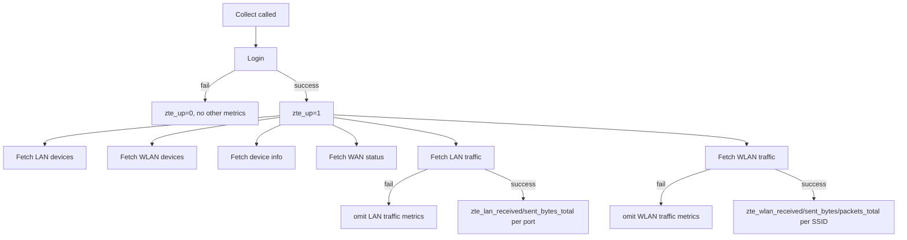

# LAN/WLAN Traffic Metrics - Plan

## Goal Capsule

- **Objective:** extend the ZTE-Exporter collector with per-LAN-port and per-WLAN-SSID traffic counters (bytes for LAN; bytes and packets for WLAN), each degrading independently on failure, with unit tests and doc updates.
- **Product authority:** project "Plataforma monitorización" (no specific Notion task cited for this feature).
- **Open blockers:** none launch-blocking. `wlan_status_lua.lua` and `eth_lanstatus_lua.lua`'s field names and section shapes come from a live H3600P capture pasted into this brainstorm, not from independent repo verification — see Dependencies / Assumptions.

---

## Product Contract

### Summary

Add per-LAN-port bytes counters and per-WLAN-SSID bytes+packets counters to the exporter's existing per-collector-degradation model. Every physical LAN port and every WLAN SSID slot always gets a metric series, regardless of current link/enable state.

### Problem Frame

The exporter currently reports only connected-device *counts* for LAN and WLAN (`zte_lan_connected_devices`, `zte_wlan_connected_devices`); it has no visibility into how much traffic is actually moving through each port or radio. A single "up" boolean per collector can't answer "is the 5GHz radio saturated?" or "which LAN port is doing the work?" — questions that matter once basic reachability is already established by the existing collectors.

### Key Decisions

- **Per-entity granularity, not aggregate totals (KD1):** one metric series per physical LAN port and per WLAN SSID slot, not a single summed "LAN total" / "WLAN total." Matches the router's native per-port/per-SSID data shape and preserves breakdowns (e.g. 2.4GHz vs 5GHz) an aggregate would hide. (session-settled: user-directed — chosen over aggregation: the router already reports per-entity data, and aggregating would hide per-port/per-band breakdown). Governs R1, R2, R4, R5.
- **Every port/SSID slot always reported, active or not (KD2):** a LAN port with no cable and a disabled WLAN SSID both still get a full series, always at zero when idle. (session-settled: user-directed — chosen over reporting only currently-linked/enabled entities: either can go active later, and a stable series set beats one that appears and disappears in Prometheus). Governs R2, R5.
- **WLAN labeled by stable AP slot id + ESSID + band, not ESSID alone (KD3):** (session-settled: user-directed — chosen over ESSID-only labeling: ESSID is user-editable in the router UI, so an ESSID-only label would fragment Prometheus history on rename). Governs R5.
- **LAN packet counts out of scope (KD4):** (session-settled: user-directed — chosen over searching for an alternate endpoint: `eth_lanstatus_lua.lua`'s live response, captured in this brainstorm, has `BytesReceived`/`BytesSent` per port and no packet fields anywhere; WLAN's `wlan_status_lua.lua` does carry packet fields, so only LAN packets are affected). See Scope Boundaries.

### Requirements

**LAN traffic collector**
- R1. The exporter fetches per-port LAN traffic counters from `eth_lanstatus_lua.lua`'s menuData, primed by the existing `localNetStatus` menuView context already used for LAN/WLAN device fetches, reading `BytesReceived`/`BytesSent` for each `OBJ_ETH_ID` instance (one per physical LAN port).
- R2. The exporter exposes a bytes-received counter and a bytes-sent counter for LAN traffic (e.g. `zte_lan_received_bytes_total` / `zte_lan_sent_bytes_total`), labeled by port using the router's `AliasName` field (`LAN1`, `LAN2`, `LAN3`), with one series pair per physical port emitted every scrape regardless of the port's current link status (KD1, KD2).
- R3. A LAN traffic fetch failure omits the LAN traffic metrics for that scrape only; it does not affect `zte_up`, `zte_lan_connected_devices`, or any other collector's metrics.

**WLAN traffic collector**
- R4. The exporter fetches per-SSID WLAN traffic counters from `wlan_status_lua.lua`'s menuData, primed by the same `localNetStatus` menuView context, reading `TotalBytesReceived`/`TotalBytesSent`/`TotalPacketsReceived`/`TotalPacketsSent` for each `OBJ_WLANCONFIGDRV_ID` instance (one per SSID slot), joined to its `ESSID` (from the matching `OBJ_WLANAP_ID` instance) and its band — `2.4GHz` or `5GHz` — via `WLANViewName` resolving against `OBJ_WLANSETTING_ID`.
- R5. The exporter exposes a bytes-received counter, a bytes-sent counter, a packets-received counter, and a packets-sent counter for WLAN traffic (e.g. `zte_wlan_received_bytes_total` / `zte_wlan_sent_bytes_total` / `zte_wlan_received_packets_total` / `zte_wlan_sent_packets_total`), labeled by stable AP slot id, ESSID, and band, with one series set per SSID slot emitted every scrape regardless of the slot's `Enable` state (KD1, KD2, KD3).
- R6. A WLAN traffic fetch failure omits the WLAN traffic metrics for that scrape only; it does not affect `zte_up`, `zte_wlan_connected_devices`, or any other collector's metrics.

**Cross-cutting**
- R7. Each new collector has unit test coverage following the existing pattern in `internal/collector/collector_test.go` and `internal/zteclient/*_test.go` (success, fetch-failure, and parse-error cases per collector).
- R8. `README.md`'s metrics table is updated with every new metric.
- R9. `docs/uml.md` and `docs/flows.md` are updated in the same change to reflect the new collectors.

### Key Flows

- F1. Scrape with two additional independently-guarded fetches
  - **Trigger:** Prometheus `GET /metrics`.
  - **Actors:** Exporter, ZTE H3600P router.
  - **Steps:** After login succeeds and `zte_up=1`, the existing LAN devices, WLAN devices, device info, and WAN status fetches run as today, plus two new fetches — LAN traffic (`eth_lanstatus_lua.lua`) and WLAN traffic (`wlan_status_lua.lua`) — each guarded the same way: a failure omits only that fetch's metrics.
  - **Outcome:** the scrape response reflects login success/failure via `zte_up`, plus whichever of the six metric groups succeeded this cycle.
  - **Covers:** R1, R3, R4, R6



### Acceptance Examples

- AE1. **Covers R2.** Given a live router with `LAN2`/`LAN3` in `NoLink` status and zero traffic, when the exporter scrapes, then `zte_lan_received_bytes_total{port="LAN2"}` and `zte_lan_sent_bytes_total{port="LAN2"}` are still emitted (value 0) alongside the `Up` port's non-zero counters.
- AE2. **Covers R5.** Given a live router with SSID slots 3–8 disabled (`Enable=0`), when the exporter scrapes, then a full counter series set (bytes + packets, received + sent) is still emitted for every disabled slot, labeled with its placeholder ESSID (e.g. `essid="SSID3"`) and resolved band, all at value 0.
- AE3. **Covers R3, R6.** Given the router successfully returns LAN devices, WLAN devices, device info, and WAN status, but the WLAN traffic fetch fails, when the exporter scrapes, then `zte_up=1` and every other metric group is present, but no WLAN traffic series are emitted that cycle.
- AE4. **Covers R4.** Given `wlan_status_lua.lua`'s response has `WLANViewName="DEV.WIFI.RD2"` for an AP instance and `OBJ_WLANSETTING_ID` maps `DEV.WIFI.RD2` to `Band="5GHz"`, when the exporter parses the response, then that AP's traffic series carries label `band="5GHz"`.

### Scope Boundaries

- LAN packet counts — not exposed; `eth_lanstatus_lua.lua`'s response has no packet fields for any LAN port (KD4).
- IP/DHCP fields from `eth_lanstatus_lua.lua`'s `OBJ_WANLAN_ID` section (per-port IPv4/IPv6 address) — not requested.
- WLAN security/channel fields from `wlan_status_lua.lua` (`ChannelInUsed`, `Bssid`, encryption/auth mode settings) — not requested.
- Per-collector enable/disable config toggles — matches the existing collector's established boundary; all collectors always run every scrape.
- Dedicated per-collector up/failure gauges — matches the existing collector's established boundary; metric absence remains the failure signal.

### Dependencies / Assumptions

- `wlan_status_lua.lua` and `eth_lanstatus_lua.lua`'s field names and section names (`OBJ_ETH_ID`, `OBJ_WLANAP_ID`, `OBJ_WLANCONFIGDRV_ID`, `OBJ_WLANSETTING_ID`) come from a live H3600P capture pasted into this brainstorm, not independently re-verified against the router.
- `AliasName` (`LAN1`/`LAN2`/`LAN3`) is assumed router-assigned and not user-editable, unlike WLAN's `ESSID` — this is why LAN's port label needs no separate stable-id split the way WLAN's does (KD3). Unconfirmed against router firmware documentation.
- The WLAN AP-to-band join (`WLANViewName` → `OBJ_WLANSETTING_ID`) is assumed stable across scrapes; unconfirmed whether a router with reconfigured radios could remap `DEV.WIFI.RD1`/`RD2` band assignments.

### Outstanding Questions

**Resolve before planning:**
- None — all product-shape decisions were resolved in dialogue.

**Deferred to planning / implementation:**
- Q1 (resolved during planning — see KTD2). `eth_lanstatus_lua.lua` and `wlan_status_lua.lua` each work off their own independent `localNetStatus` menuView priming call via the existing `fetchMenuData` helper, which already re-primes unconditionally on every call — no chained priming sequence like WAN's is needed.
- Q2 (partially resolved during planning — see KTD4). The WLAN traffic-to-identity join key is confirmed from the live capture: `_InstID` joins `OBJ_WLANCONFIGDRV_ID` to `OBJ_WLANAP_ID`, and `WLANViewName` joins to `OBJ_WLANSETTING_ID`. Still open: whether the router's instance count/order for `OBJ_ETH_ID`, `OBJ_WLANCONFIGDRV_ID`/`OBJ_WLANAP_ID`/`OBJ_WLANSETTING_ID` holds across firmware versions and multi-radio configurations, beyond the single sample response captured here — deferred to implementation/live verification.

### Sources / Research

- `internal/zteclient/devices.go:61-92` — existing `localNetStatusTag`/`getDevices` pattern already fetches this same menuView context for LAN/WLAN device lists; the new traffic fetches are additional menuData calls under the same priming tag.
- `internal/zteclient/wanstatus.go` — existing pattern for a page needing more than one menuData script in sequence (`ethInterfaceScript` before `wanStatusScript`), and for pointer-typed fields so one malformed field doesn't discard its siblings.
- `internal/collector/collector.go:136-139` — current four independently-guarded fetch steps (`collectLAN`, `collectWLAN`, `collectDeviceInfo`, `collectWANStatus`) that the two new fetches extend.
- `docs/plans/2026-07-17-001-feat-remaining-collectors-plan.md` — sibling plan establishing the per-collector degradation model, the "omit rather than fabricate" failure philosophy, and the `zte_<domain>_<measure>[_total]` naming convention this plan follows.
- Live H3600P captures of `wlan_status_lua.lua` and `eth_lanstatus_lua.lua` responses, pasted into this brainstorm's invocation — source of all field/section names and the confirmed absence of LAN packet fields.

**Product Contract preservation:** unchanged from the brainstorm.

---

## Planning Contract

### Key Technical Decisions

- **Extend existing parse helpers; no new generic abstraction (KTD1):** the two new fetches add domain-shaping functions (mirroring `devicesFromInstances`) on top of the existing `instance`/`instanceContainer`/`findSections`/`parseRequiredUint` helpers in `internal/zteclient/devices.go`, which already handle arbitrary named sections with repeated or single instances. No generic/parameterized parser and no Go generics are introduced — the codebase uses none today. Governs R1, R4.
- **Independent re-priming per new fetch (KTD2):** `GetLANTraffic` and `GetWLANTraffic` each call the existing `fetchMenuData(ctx, localNetStatusTag, script, label)` helper independently, the same way `GetLANDevices`/`GetWLANDevices` already do, rather than chaining like the WAN status fetch's two-script sequence. (session-settled: user-approved — chosen over chained priming: keeps a LAN traffic fetch failure from being able to cascade into WLAN traffic, and vice versa, matching R3/R6). Governs R1, R3, R4, R6.
- **Missing label-source field degrades the field, not the entity (KTD3):** when a LAN port's `AliasName` or a WLAN slot's ESSID/band join is missing or unparseable, that entity's counters are still emitted with an empty string for the affected label rather than being dropped from the scrape. (session-settled: user-approved — chosen over skipping the entity: preserves the Product Contract's "every port/SSID slot always reported" guarantee, KD2, even under malformed router data, matching the pointer-per-field degrade philosophy `WANStatus`/`DeviceInfo` already use for single-instance pages). Governs R2, R5.
- **WLAN join keys, confirmed from the live capture (KTD4):** `_InstID` (e.g. `DEV.WIFI.AP1`) matches an `OBJ_WLANCONFIGDRV_ID` traffic instance to its `OBJ_WLANAP_ID` ESSID instance; `WLANViewName`, present on both AP-level sections, matches to the `OBJ_WLANSETTING_ID` instance whose `_InstID` supplies the band (`DEV.WIFI.RD1` → `2.4GHz`, `DEV.WIFI.RD2` → `5GHz`). `_InstID` also supplies the "stable AP slot id" label KD3 requires. Governs R4, R5.
- **New counters are `CounterValue` with reset-on-reboot documentation (KTD5):** the LAN bytes counters and the WLAN bytes/packets counters (this exporter's first packet-based metric) are registered as `prometheus.CounterValue`, and their `Desc` HELP strings and the README table both carry the same "resets on router reboot/interface reset" caveat `zte_wan_received_bytes_total` already documents. Governs R2, R5, R8.

### Assumptions

- Every AP's `WLANViewName` resolves to one of the `OBJ_WLANSETTING_ID` radio instances during normal operation; KTD3's empty-band fallback is expected to trigger only on a genuinely malformed or unexpected response, not in routine operation.
- The router's `_InstID` values are stable, firmware-assigned identifiers, not user-editable — the same trust level as `_InstID` usage already relied on elsewhere in the codebase (e.g. `ID_WAN_COMFIG`, device info's element).
- `eth_lanstatus_lua.lua` always reports exactly the router's physical LAN ports (3 on the H3600P sample) as separate `OBJ_ETH_ID` instances; a firmware variant with a different port count is handled by construction (R2 emits one series pair per instance found) without code changes.

### Sequencing

U1 and U2 are independent of each other (both build on the existing `devices.go` helpers, not on each other). U3 depends on U1 and U2 for the two client methods it wires into `Collect`. U4 depends on U1-U3 being final so the diagrams and tables describe the shipped shape.

### Risks & Dependencies

- No checked-in fixture data exists yet for `eth_lanstatus_lua.lua`/`wlan_status_lua.lua` — every prior collector's tests mirror a real captured XML response; this feature's test fixtures are hand-built from the live capture pasted into the brainstorm and reproduced in this plan's Sources, carrying the same risk class already flagged in Dependencies/Assumptions (Q2).
- Depends on physical access to a live ZTE H3600P router to verify the assumptions above and to run any manual end-to-end check beyond the fake-router unit tests.

---

## Implementation Units

### U1. LAN traffic fetch

- **Goal:** Add `GetLANTraffic` to the zteclient package, fetching per-port LAN traffic counters via `eth_lanstatus_lua.lua` and applying the label fallback KTD3 defines.
- **Requirements:** R1, R2, R3
- **Dependencies:** none
- **Files:**
  - `internal/zteclient/lantraffic.go` (new — `LANPortTraffic` struct, `lanTrafficScript` const, `GetLANTraffic`)
  - `internal/zteclient/lantraffic_test.go` (new)
- **Approach:**
  1. Define `LANPortTraffic{Port string; BytesReceived, BytesSent *uint64}`.
  2. `GetLANTraffic` calls `fetchMenuData(ctx, localNetStatusTag, lanTrafficScript, "LAN traffic")` (KTD2), then `findSections` on a LAN-specific id-element constant (distinct name from `wanstatus.go`'s `ethInterfaceIDElement`, per KTD1, even though both currently resolve to `OBJ_ETH_ID`).
  3. Build one `LANPortTraffic` per instance: `Port` prefers `AliasName`, falls back to `_InstID` when empty (KTD3); `BytesReceived`/`BytesSent` via `parseRequiredUint`, left nil on a per-field parse failure (KTD3) with a `slog.Warn`.
- **Patterns to follow:** `internal/zteclient/devices.go:65-92` (`GetLANDevices`/`getDevices`) for the fetch-then-parse shape; `internal/zteclient/wanstatus.go`'s `addInterfaceCounters` for per-field pointer degrade.
- **Test scenarios:**
  - Happy path: fixture with 3 ports (1 `Up`, 2 `NoLink`, mirroring the live sample) → 3 entries with correct port labels and byte values, including the zero-valued `NoLink` ports. Covers R1, R2.
  - Label fallback: an instance with empty/absent `AliasName` → falls back to `_InstID`, still emitted. Covers R2 (KTD3).
  - Field degrade: one instance has an unparseable `BytesSent` → that field is nil; the port label and `BytesReceived` are still populated. Covers R2 (KTD3).
  - Error path: the menuView priming GET fails → `GetLANTraffic` returns an error. Covers R3.
  - Error path: the menuData GET returns invalid XML → `GetLANTraffic` returns a parse error. Covers R3.
- **Verification:** `go test ./internal/zteclient/...` passes; new LAN traffic tests fail before the change and pass after.

### U2. WLAN traffic fetch

- **Goal:** Add `GetWLANTraffic` to the zteclient package, fetching per-SSID WLAN bytes+packets counters via `wlan_status_lua.lua` and joining them to ESSID and band per KTD4.
- **Requirements:** R4, R5, R6
- **Dependencies:** none
- **Files:**
  - `internal/zteclient/wlantraffic.go` (new — `WLANSSIDTraffic` struct, `wlanTrafficScript` const, `GetWLANTraffic`)
  - `internal/zteclient/wlantraffic_test.go` (new)
- **Approach:**
  1. Define `WLANSSIDTraffic{APID, ESSID, Band string; BytesReceived, BytesSent, PacketsReceived, PacketsSent *uint64}`.
  2. `GetWLANTraffic` calls `fetchMenuData(ctx, localNetStatusTag, wlanTrafficScript, "WLAN traffic")` (KTD2), then three `findSections` calls on the same body: `OBJ_WLANCONFIGDRV_ID` (traffic), `OBJ_WLANAP_ID` (ESSID), `OBJ_WLANSETTING_ID` (band).
  3. Index the AP and Setting sections by `_InstID`; iterate CONFIGDRV instances, join to ESSID by `_InstID` and to band by `WLANViewName` (KTD4); a join miss leaves `ESSID`/`Band` as `""` rather than dropping the entity (KTD3).
  4. Byte/packet fields via `parseRequiredUint`, left nil on a per-field parse failure.
- **Technical design** *(directional, not implementation-specification)*:
  ```
  GetWLANTraffic(ctx):
    body := fetchMenuData(ctx, localNetStatusTag, wlanTrafficScript, "WLAN traffic")
    configdrv := findSections(body, "OBJ_WLANCONFIGDRV_ID")
    apByID := indexBy_InstID(findSections(body, "OBJ_WLANAP_ID"))
    bandByID := indexBy_InstID(findSections(body, "OBJ_WLANSETTING_ID"))
    for each instance in configdrv:
      ap := apByID[instance._InstID]            // KTD4 join; miss -> ESSID ""
      band := bandByID[instance.WLANViewName]    // KTD4 join; miss -> Band ""
      emit WLANSSIDTraffic{APID: instance._InstID, ESSID: ap.ESSID, Band: band.Band, counters...}
  ```
- **Patterns to follow:** `internal/zteclient/devices.go`'s `findSections`/`instance.params()` for repeated-section parsing; `wanstatus.go`'s pointer-per-field degrade.
- **Test scenarios:**
  - Happy path: fixture mirroring the live sample (8 SSID slots, 2 enabled across both radios) → 8 entries with correct ESSID/band/counters, including the zero-valued disabled slots. Covers R4, R5.
  - Join miss (ESSID): a `OBJ_WLANCONFIGDRV_ID` instance whose `_InstID` has no matching `OBJ_WLANAP_ID` instance → still emitted, `ESSID=""`. Covers R5 (KTD3).
  - Join miss (band): a `WLANViewName` with no matching `OBJ_WLANSETTING_ID` instance → still emitted, `Band=""`. Covers R5 (KTD3).
  - Field degrade: one instance has an unparseable `TotalPacketsSent` → that field is nil; siblings unaffected. Covers R5.
  - Error path: the menuView priming GET fails → `GetWLANTraffic` returns an error. Covers R6.
  - Error path: the menuData GET returns invalid XML → `GetWLANTraffic` returns a parse error. Covers R6.
- **Verification:** `go test ./internal/zteclient/...` passes.

### U3. Collector wiring: LAN/WLAN traffic gauges and independent degradation

- **Goal:** Wire `GetLANTraffic`/`GetWLANTraffic` into `Collector.Collect` as two more independently-guarded steps, emitting labeled counters for every returned entity.
- **Requirements:** R1, R2, R3, R4, R5, R6, R8
- **Dependencies:** U1, U2
- **Files:**
  - `internal/collector/collector.go` (modify)
  - `internal/collector/collector_test.go` (modify)
- **Approach:**
  1. Add 6 `*prometheus.Desc` fields: `lanBytesReceivedDesc`/`lanBytesSentDesc` (label: `port`), `wlanBytesReceivedDesc`/`wlanBytesSentDesc`/`wlanPacketsReceivedDesc`/`wlanPacketsSentDesc` (labels: `ap`, `essid`, `band`), each `_total`-suffixed with a "resets on router reboot" HELP-string caveat (KTD5). Register in `New()` and `Describe()`.
  2. Add `collectLANTraffic`/`collectWLANTraffic`, mirroring `collectLAN`/`collectWLAN`: on fetch error, `slog.Warn` and return (R3, R6); on success, loop over returned entities and emit one `MustNewConstMetric(desc, prometheus.CounterValue, ...)` per non-nil counter field per entity, so a single nil field skips only its own metric, not its entity's other metrics (KTD3).
  3. Call both from `Collect` after the four existing `collectX` calls.
  4. Update `TestDescribe`'s hardcoded desc count (9 → 15).
- **Patterns to follow:** `internal/collector/collector.go:153-159` (`collectWLAN`) for the fetch/guard shape; `collectWANStatus` (`internal/collector/collector.go:193-215`) for looping optional pointer fields into `MustNewConstMetric`.
- **Test scenarios:**
  - Happy path: fake router succeeds on all six fetches → all new counters collected with correct label sets and values alongside the four existing metric groups. Covers R1, R2, R4, R5.
  - Degradation: LAN traffic fetch fails, WLAN traffic fetch succeeds → `zte_up=1`, no LAN traffic series, WLAN traffic series present, the four pre-existing groups unaffected. Covers R3.
  - Degradation: WLAN traffic fetch fails, LAN traffic fetch succeeds → mirror of the above. Covers R6.
  - Degradation: both new fetches fail while the four pre-existing groups succeed → `zte_up=1`, neither new metric group present, existing four unaffected. Covers R3, R6.
  - Label fallback: a LAN port fixture missing `AliasName` → its series still appears, `port` label falls back to `_InstID`. Covers R2 (KTD3).
  - Regression: `TestDescribe` asserts the updated total desc count (15).
- **Verification:** `go test ./internal/collector/...` passes, including the updated `TestDescribe` and the new degradation cases above.

### U4. Documentation updates

- **Goal:** Update README, `docs/uml.md`, and `docs/flows.md` to describe the two new collectors, their metrics, and the join/degrade behavior KTD2-KTD5 establish.
- **Requirements:** R8, R9
- **Dependencies:** U1, U2, U3
- **Files:**
  - `README.md` (modify — metrics table)
  - `docs/uml.md` (modify — class diagram and notes)
  - `docs/flows.md` (modify — sequence diagram and notes)
- **Approach:** Extend the README metrics table with the 6 new rows, each carrying the "counter, resets on router reboot" caveat (KTD5). Update `docs/uml.md`'s `Client`/`Collector` classes with the new methods, Desc fields, and `LANPortTraffic`/`WLANSSIDTraffic` structs, plus a Notes bullet on the WLAN 3-way join (KTD4) and the label-fallback behavior (KTD3). Extend `docs/flows.md`'s sequence diagram with the two new fetch branches (already sketched in the Product Contract's F1 diagram) and a Notes bullet on independent re-priming (KTD2).
- **Test expectation:** none — documentation-only, no behavioral change to verify.
- **Verification:** manual read-through confirms the diagrams and tables match the shipped code from U1-U3.

---

## Verification Contract

| Command | Applies to | Gate |
|---|---|---|
| `go build ./...` | all units | must succeed |
| `go vet ./...` | all units | must succeed |
| `go test ./...` | U1-U3 | all tests pass, including the new LAN/WLAN traffic and degradation coverage |
| `pre-commit run --all-files` | all units | lint (`.golangci.yml`) and formatting pass |

---

## Definition of Done

- All units complete; `go build ./...`, `go vet ./...`, `go test ./...`, and `pre-commit run --all-files` all pass.
- `zte_lan_received_bytes_total`, `zte_lan_sent_bytes_total`, `zte_wlan_received_bytes_total`, `zte_wlan_sent_bytes_total`, `zte_wlan_received_packets_total`, and `zte_wlan_sent_packets_total` are all present in `/metrics` output against a live or faked router, with one series per LAN port and per WLAN SSID slot regardless of link/enable state.
- A LAN traffic or WLAN traffic fetch failure omits only that fetch's metrics for the scrape — verified by U3's degradation test scenarios (R3, R6) — and the two new fetches fail independently of each other.
- README, `docs/uml.md`, and `docs/flows.md` reflect the shipped collectors.
- No dead-end or experimental code from unused approaches remains in the diff.
