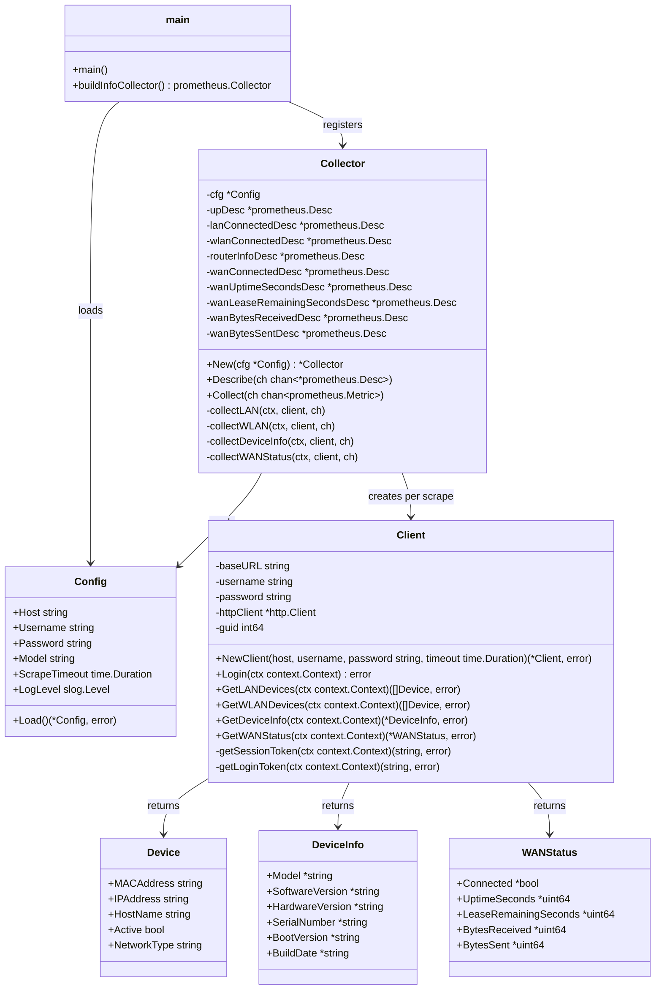

# Architecture (UML)

## Module overview

## Notes

- `Collector` implements `prometheus.Collector`. `Collect` logs in once per
  scrape, then runs the LAN, WLAN, device info, and WAN status fetches
  independently: a login failure reports `zte_up=0` and omits every other
  metric, but once login succeeds `zte_up=1` regardless of what happens
  next, and each fetch's failure only omits that fetch's own metrics for
  the cycle.
- `Collector` holds only immutable `*prometheus.Desc` fields (built once in
  `New`), not `prometheus.Gauge` state. `Collect` computes every value
  locally per call and sends it via `prometheus.NewConstMetric`, so
  concurrent `Collect` calls (e.g. overlapping scrapes) never share
  mutable state.
- `Client` is created fresh per scrape in this version; session reuse
  across scrapes is tracked separately (see project task "Reliability:
  scrape failures & session handling").
- `Device` is shared between LAN and WLAN collection; the `NetworkType`
  field distinguishes them. `GetWLANDevices` reuses the same
  `parseDevices` machinery as `GetLANDevices`, parameterized by script
  name and id element.
- `WANStatus` and `DeviceInfo` are both parsed via `parseSingleInstance`,
  confirmed against a live H3600P to nest one `Instance` under a
  page-specific element (`ID_WAN_COMFIG` for WAN status,
  `OBJ_DEVINFO_ID` for device info) — the same document shape `Device`
  parsing uses, just with exactly one `Instance` instead of many. Every
  field on `DeviceInfo` and `WANStatus` is a pointer: a single
  unparseable or missing field is logged and left `nil` rather than
  discarding its otherwise-valid siblings, so e.g. a malformed lease-time
  reading doesn't blank connection status/uptime too. `DeviceInfo` is
  exposed as a single labeled `zte_router_info` gauge rather than several
  metrics, so a missing field there becomes an empty label value instead
  of a `nil` pointer omitting a metric.
- The WAN status fetch primes its page context once, then issues two
  sequential `menuData` calls rather than re-priming between them:
  `eth_interface_status_lua.lua` establishes the sub-page context that
  `wan_internet_lua.lua` (the connection status/uptime/lease data)
  requires, confirmed against a live H3600P's real request order.
  `eth_interface_status_lua.lua`'s response is also parsed for
  `BytesReceived`/`BytesSent` (the WAN interface's cumulative traffic
  counters), exposed as `zte_wan_received_bytes_total` /
  `zte_wan_sent_bytes_total` — the only Counter-type metrics in this
  exporter; every other metric is a Gauge.
