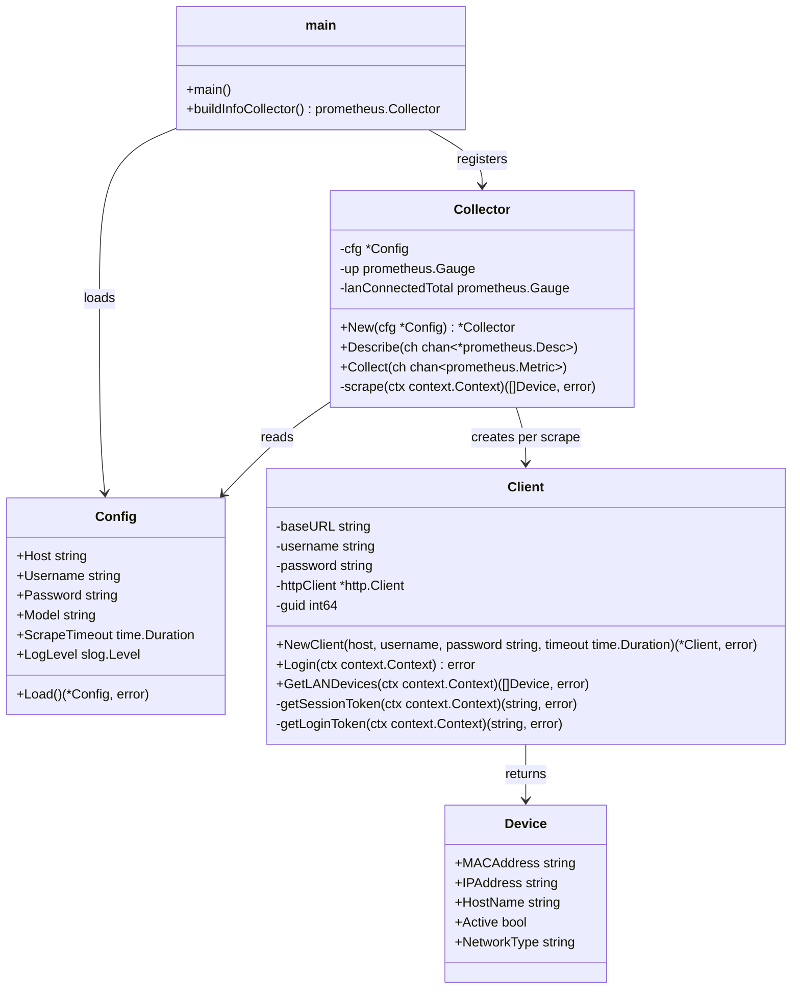

# Architecture (UML)

## Module overview

## Notes

- `Collector` implements `prometheus.Collector` and performs a fresh
  scrape (login + data fetch) on every `Collect` call; nothing is cached
  between Prometheus scrapes.
- `Client` is created fresh per scrape in this version; session reuse
  across scrapes is tracked separately (see project task "Reliability:
  scrape failures & session handling").
- `Device` is shared between LAN and (future) WLAN collection; the
  `NetworkType` field distinguishes them.
