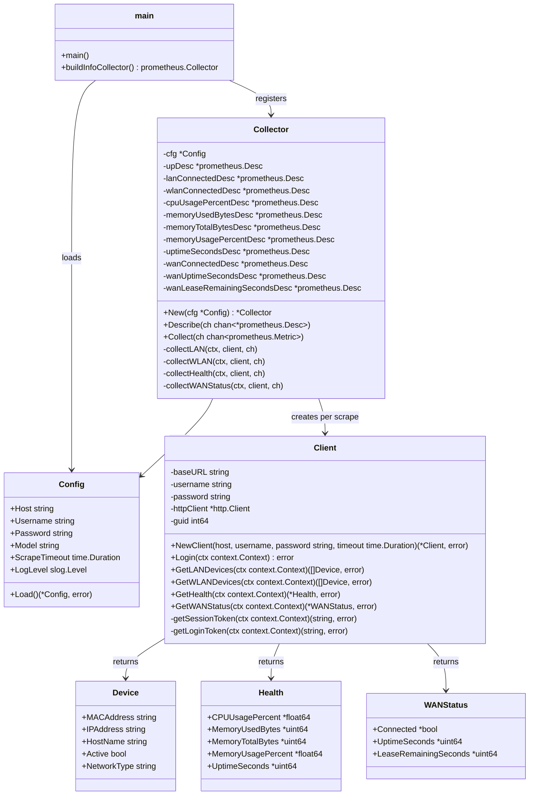

# Architecture (UML)

## Module overview

## Notes

- `Collector` implements `prometheus.Collector`. `Collect` logs in once per
  scrape, then runs the LAN, WLAN, health, and WAN status fetches
  independently: a login failure reports `zte_up=0` and omits every other
  metric, but once login succeeds `zte_up=1` regardless of what happens
  next, and each fetch's failure only omits that fetch's own metrics for
  the cycle.
- `Collector` holds only immutable `*prometheus.Desc` fields (built once in
  `New`), not `prometheus.Gauge` state. `Collect` computes every value
  locally per call and sends it via `prometheus.NewConstMetric`, so
  concurrent `Collect` calls (e.g. overlapping scrapes) never share
  mutable state.
- `Client` is created fresh per scrape in this version; session reuse
  across scrapes is tracked separately (see project task "Reliability:
  scrape failures & session handling").
- `Device` is shared between LAN and WLAN collection; the `NetworkType`
  field distinguishes them. `GetWLANDevices` reuses the same
  `parseDevices` machinery as `GetLANDevices`, parameterized by script
  name and id element.
- `WANStatus` is parsed via `parseSingleInstance`, confirmed against a
  live H3600P to nest one `Instance` under a page-specific element
  (`ID_WAN_COMFIG`) — the same document shape `Device` parsing uses, just
  with exactly one `Instance` instead of many. `Health`'s response shape
  is still unconfirmed and uses `parseFlatParams` (a flat root-level
  `ParaName`/`ParaValue` sequence) pending live verification. Every field
  on `Health` and `WANStatus` is a pointer: a single unparseable or
  missing field is logged and left `nil` rather than discarding its
  otherwise-valid siblings, so e.g. a bad memory reading doesn't blank
  CPU/uptime too.
- The WAN status fetch primes its page context once, then issues two
  sequential `menuData` calls rather than re-priming between them:
  `eth_interface_status_lua.lua` (discarded) establishes the sub-page
  context that `wan_internet_lua.lua` (the actual data) requires,
  confirmed against a live H3600P's real request order.
